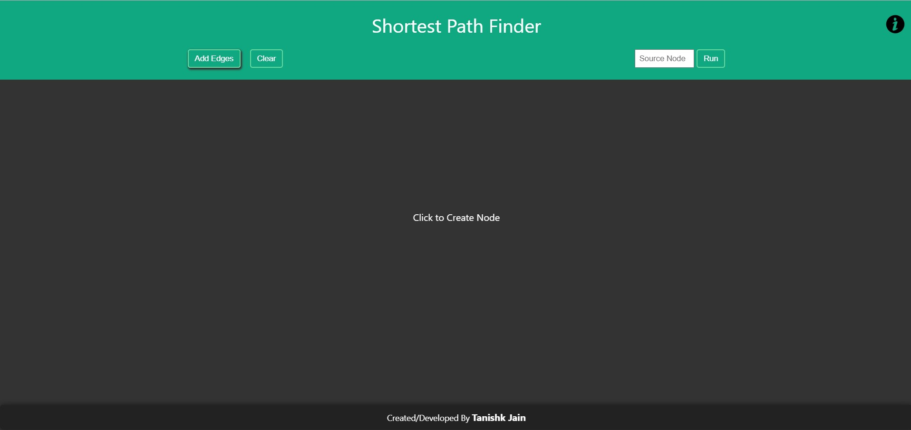
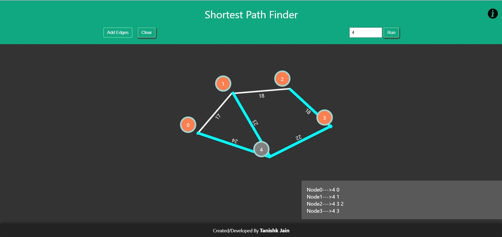

# 📊 Project Overview

The Shortest Path Finder is a web-based project that visualizes the shortest path between nodes using Dijkstra's Algorithm. It allows users to interactively create nodes, add weighted edges, and calculate the shortest path from a given source node to all other nodes.

## 🚀 Features

- Interactive node creation: Click anywhere on the drawing area to create nodes.
- Dynamic edge addition: Add edges between nodes with automatically or manually assigned weights.
- Shortest Path Calculation: Uses Dijkstra's Algorithm  📊 Shortest Route Finder

The **Shortest Route Finder** is a web-based interactive tool that allows users to visualize and compute the shortest path between nodes using **Dijkstra's Algorithm**. This project provides an engaging way to understand graph theory and pathfinding algorithms.

## 🚀 Features

- **Interactive Node Creation**: Click anywhere on the drawing area to create nodes.
- **Dynamic Edge Addition**: Add weighted edges between nodes, either manually or automatically.
- **Shortest Path Calculation**: Implements **Dijkstra's Algorithm** to determine and display the shortest path from a selected source node.
- **Editable Edge Weights**: Change edge weights dynamically for different scenarios.
- **Visual Shortest Path Highlighting**: Highlights the shortest path on the graph for better visualization.
- **Responsive Design**: Works seamlessly on various screen sizes and devices.

## 📸 Screenshots

### User Interface


### Shortest Path Visualization


## 🛠️ Technologies Used

- **HTML, CSS, JavaScript** – For building the interactive front-end.
- **Dijkstra's Algorithm** – Core logic for pathfinding.
- **GSAP (GreenSock Animation Platform)** – For smooth animations and transitions.

## 🎯 How to Use

1. **Open the Web Application**
   - Clone the repository and open `index.html` in a browser.
2. **Create Nodes**
   - Click anywhere on the canvas to add nodes.
3. **Connect Nodes**
   - Drag from one node to another to create edges.
4. **Set Edge Weights**
   - Edit weights dynamically for different scenarios.
5. **Find Shortest Path**
   - Select a source node and visualize the shortest route using **Dijkstra's Algorithm**.

## 📂 Installation

1. Clone this repository:
   ```bash
   git clone https://github.com/TANISHK-1507/Shortest-Route-Finder.git
   ```
2. Navigate to the project folder:
   ```bash
   cd Shortest-Route-Finder
   ```
3. Open `index.html` in a web browser.

## 🔥 Future Enhancements

- Implement additional shortest path algorithms (A*, Bellman-Ford, Floyd-Warshall, etc.).
- Add an **undo/redo** feature for better usability.
- Improve UI/UX with **advanced animations** and styles.
- Implement **real-world applications** like traffic routing and logistics planning.

